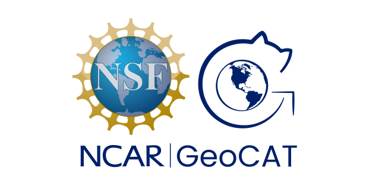

# Project Raijin

Project Raijin is an NSF EarthCube-funded effort whose goal is to
enhance the open source analysis and visualization tool landscape
by developing community-owned, sustainable, scalable tools that
facilitate operating on unstructured climate and global weather
data. Working in close collaboration with atmospheric modelers,
we plan to: (1) develop extensible, scalable, open source tools
supporting fundamental analysis and visualization methods capable
of operating directly (without resampling) on unstructured grid
model outputs at global storm resolving resolutions; and (2)
establish an active, vibrant community of user-contributors,
committed to extending our work beyond the scope of this NSF
award, thus helping ensure the long term sustainability of
the project

<span class="d-flex justify-content-center py-4">
    <a href="/about.html" role="button" class="btn btn-light btn-lg">
        Read more about Project Raijin
    </a>
</span>

## Development Environment

The primary environment for Project Raijin is the Scientific
Python Ecosystem. We will leverage, in particular, the open
development Xarray and Dask packages, and the Pangeo community.
To better support both of these primary goals, our work will be
conducted under an open development model that encourages
participation in all aspects of the project’s development. This
presentation will provide an overview of Project Raijin, with an
emphasis on describing our open development model and how the
community can get involved.

### Contributing

Anyone can contribute to and participate in Project Raijin!
We conduct all of our work in the open, and all of our work is
Open Source Licensed.
We welcome contributions from anyone in the community.
Please see our Contributor’s Guide ...

## The Project Raijin Team

The ...

```{toctree}
---
hidden: True
maxdepth: 1
---
about.md
contributing.md
geocat.md
```
